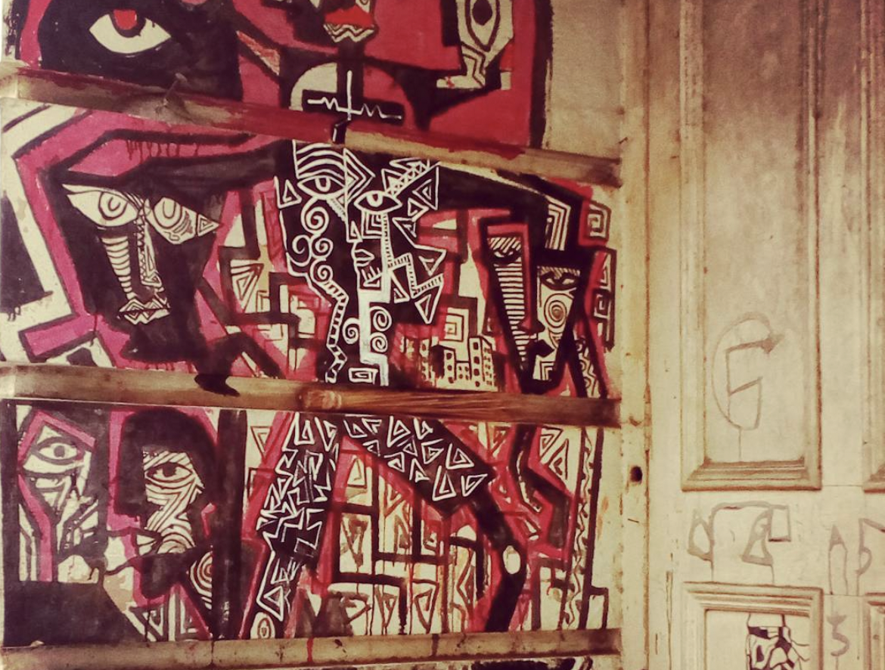

It was a huge monolithic code laying around for quite some time. It took five sprints to get its current shape and no one bothered until one needs to modify a logic there. This [broken window](https://en.wikipedia.org/wiki/Broken_windows_theory) (Thanks to my colleague who told me the story!) presents in almost every project. Based on the sensitivity of the team it might take a different time to get it fixed, refactored. I have observed a team with seasoned developers who just ignored such cracky corners but a junior team member asking for help to get those cleaned up before he cloud pound on it. I wonder, then what actually triggers the urge of code refactoring? Is this purely technical or psychological or a mix? This post is all about my feelings about what makes a developer start feeling about code refactoring.

## The sense of beauty

Have you ever noticed how we react to a beautiful piece of sculpture or paintings or any form of art? Do we think we all have the technical capabilities to appreciate that artwork? No. We have a sense of beauty embedded in us, mostly nurtured by our culture initially and later if at all by acquiring skills. Developers all have the skills to write code but do we have the culture of appreciating beautiful lines of code? To appreciate a 'clean code' you need to develop sense of fulfillment in writing the same and then articulate the same to your peer and build that culture in the team. This enables team to findout the scope of improvements which may triggers a code refactor.

- Practice doing loudly appreciate cleanly written code while you encounter or review.
- Not only code, appreciate the aptly used tools and practice around that code. Like an organized and well-sequenced set of commits, while giving pull requests (PR). Use of shortcuts in the IDE or maybe developer's machine having a cool shell.
- Last but not least, appreciate the Human behind all his beautiful creations. 

## Crystal clear vision

Before touching the code there should be a clear-cut reasonable expectation about the final shape after refactoring. These expectations may come from experience or knowledge but the proposal must sounds feasible, realistic and bring real values to the project and finally to the team. You need to convince yourself first about the journey you are going start. Having a clear vision about the goal of refactoring helps you to make your mind.
- Articulate the 'Why' to the team and gather feedback. Team must agree to the Why and may add some more reason to it.
- Set the expectation about how code should be looking after being refactored. Gather feedback if someone already faced any challenges in similar journey.
- Understand and discuss the inherent design philosophy. It is important. While refactoring unless it is absolutely necessary try to keep existing design philosophy intact.

## Sense of amusement

Refactoring is not just a routine task for me. Reducing the lines of code, making it more readable and modular give me pleasure. I always find opportunity to get myself involved in refactoring task and eagerly wait for the end result to compare side by side. Unless you are enjoying, refactoring won't bring much value to you neither to the project. It would just be another task randomly assigned to you. Read books, listen and follow famous developers and find out your personal 'Wow' to refactor.

- Understand what value a refactored code will add. Go through books like 'Clean Code', 'Beautiful Code' to motivate yourself.
- Feel like you are giving a special touch to your codebase like an artist does. 
- Feel proud to think that fellow developer would appreciate your artwork in future like you do.

The summary of all is in the tone of Martin Fowler-

#### Any fool can write code that a computer can understand. Good programmers write code that humans can understand.
