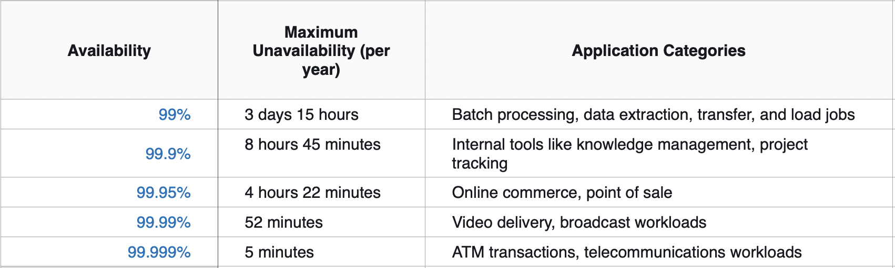
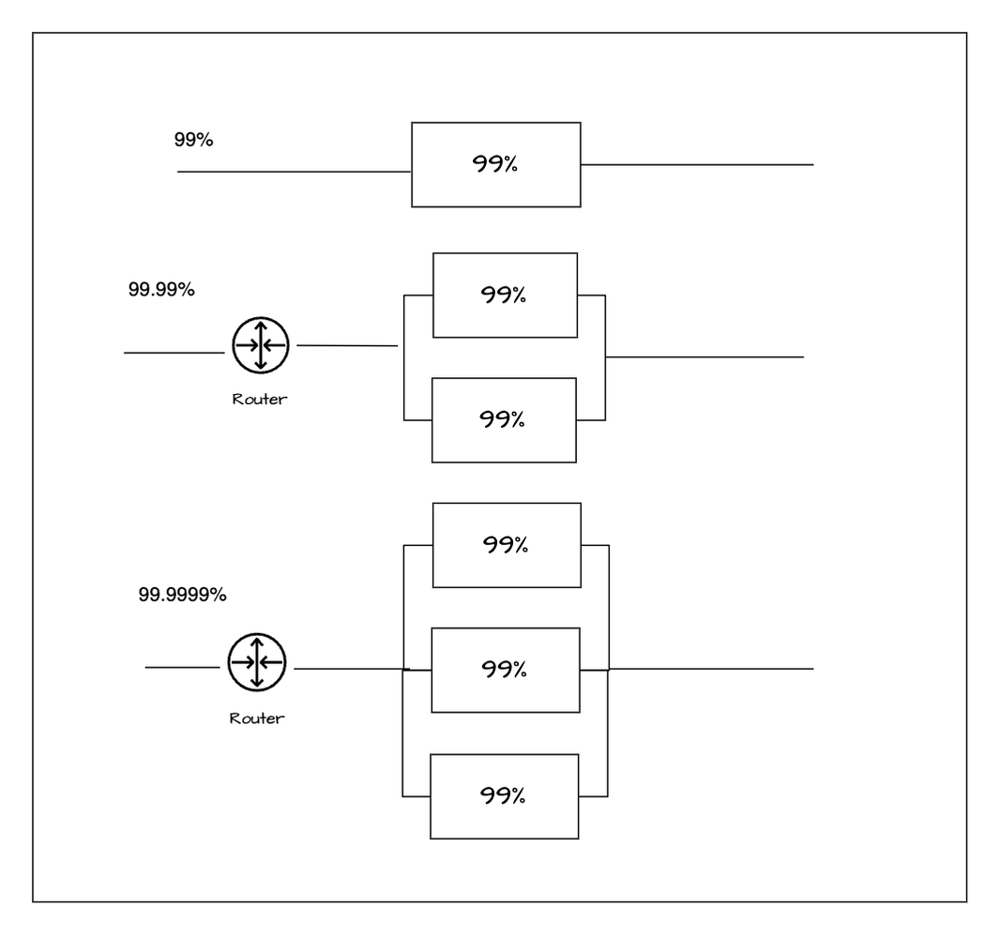

> “Do not judge me by my success, judge me by how many times I fell down and got back up again.”― Nelson Mandela

In the cloud and edge computing era, we can argue that a microservice ecosystem is nothing but a distributed system on steroids. Unlike a traditional centralized system, A distributed system is inherently prone to failure. So resiliency is the key factor to consider while architecting a highly available modern microservice architecture on top of inherently unreliable commodity cloud infrastructure. In this write-up, I am going to discuss some fundamental notions of resiliency and its possible application in system design.

## What is resiliency all about?
According to the Oxford Dictionary, resilience means -
> the capacity to withstand or to recover quickly from difficulties; toughness.

In software system purview it means how fast a system can recover from a failure. So resiliency is all about managing downtime. Downtime influences the Availability of a system, and mathematically they are related to each other
> Availability = Uptime / (Uptime + Downtime)

As per the above equation, it is evident that to increase the availability of a system either uptime has to be increased or downtime needs to be minimized. Taking into account [distributed computing fallacies](https://en.wikipedia.org/wiki/Fallacies_of_distributed_computing) we can argue that failure is inevitable in a distributed system. So modern approach should embrace failure and design systems to address it; and quickly recover from the failure, minimizing downtime.

## Availability of SaaS offerings
In 2022 YouTube generated approx $29.2bn in annual revenue. That means on average it raised ~ $3mn/hour. From that number itself, we can assume how costly a SaaS offering’s downtime could be. We need to understand that to survive in the SaaS business one has to be diligent about the SLA promised to its customer and build a process and culture to monitor availability and continuously improve upon it. Availability is commonly expressed in 9's. 

A system's availability depends on the availability of its dependencies. So if we consider a 99.99% available component depends on two other components having 99.99% available then the availability of the whole system comes out to be 99.97% (99.99%*99.99%*99.99%). So to religiously maintain the SLA of a SaaS offering one has to invest in building a solid knowledge base and culture across the team, producing individual components (microservices) reliable and resilient.

## Redundancy trade-off
With the commodity cloud hardware, it is very easy to make redundant systems available in charge. Cloud talks about scale-out. Scaling out is nothing but maintaining redundant systems to be ready in no time. From a resiliency perspective, there is a huge impact of it. Let us understand how
If a component is said to be 99% available, it means the probability of the component's failure is 
> 100%- 99% = 1% = 0.01

If we keep scaling out the system with 2 replicas of the component then the system will fail only when two components fail at the same time. So, the probability of an event where two components fail at the same time is 

> 99% * 99% = 0.01 * 0.01 = 0.0001

So the availability of the system having two replicas of the component is 

> 1- 0.0001 = 0.9999 = 99.99%

So behind all these, there is mathematics.
> A = 1 - (1-Ax)^n where A = Availibility of the system, Ax = Availability of the component, n = Number of replicas

Just adding replicas to increase the availability is not feasible. With an increase in replicas, the complexity comes. It's about the capacity and complexity of the routing layer, the placement of replicas, and above all the cost which are the deciding factors here. After all, with the addition of each replica, the cost increases linearly but not the availability of the system so it is up to the business to decide what is their sweet point.

## CAP Theorem
Distributed computing fallacies talk about network unreliability. In cloud infrastructure also it is rather impossible to think about building a SaaS system without considering the underlying network partition. Though cloud services put the best effort into hiding the network partition issues from surfacing but it is also the responsibility of a well-architect framework to design a system with the consideration of failover.

CAP theorem comes into the picture to factor in yet another trade-off during the network partition. Consistency vs Availability. To make the system more resilient partition tolerance requirement dictates the replica count and its placement. It is the trade-off between consistency and availability and balancing both as per business needs during a catastrophic network failure.
A resilient social networking system may overall prioritize the availability aspects of it but a banking system will give consistency a higher priority over availability.
There is an interesting discussion around the [ACID vs BASE philosophy](https://aws.amazon.com/compare/the-difference-between-acid-and-base-database/) of modern database systems in this regard.
In conclusion, I can say, that designing a resilient distributed system is hard and often iterative, but to stay relevant in this SaaS journey, the business has to consider the reliability aspects of it through all the phases of the software lifecycle with utmost priority.

Thank you.

--------------------

### References
- [AWS Well-Architected Framework](https://docs.aws.amazon.com/wellarchitected/latest/reliability-pillar/availability.html)
- [Patterns for Resilient Architecture by Adrian Hornsby](https://www.youtube.com/watch?v=gET51_C3k5s)
- [Availability with redundancy](https://docs.aws.amazon.com/whitepapers/latest/availability-and-beyond-improving-resilience/availability-with-redundancy.html)
- [Challenges with distributed systems](https://aws.amazon.com/builders-library/challenges-with-distributed-systems/)
